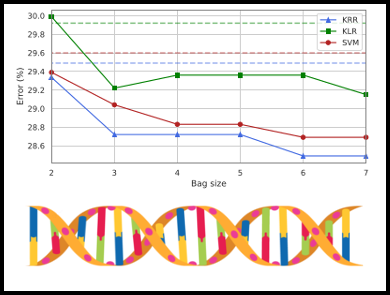

<h1 align="center">
    Transcription factor binding prediction with kernel methods
</h1>

\[[Report](report.pdf)\]

    

## Summary

* [Introduction](#introduction)
* [Dependencies](#dependencies)
* [Usage](#usage)
* [References](#references)

## Introduction

For this data challenge, our task was to predict whether input DNA sequence regions were binding or not to specific transcription factors. We implement from scratch and compare various string kernels operating on DNA sequences, alongside SVM/KRR and KLR classifiers.

This project was developed by David Emukpere and Habib Slim in the context of the Kernel Methods for Machine Learning course, taught by <a href="https://lear.inrialpes.fr/people/mairal/">Julien Mairal</a> at <a href="https://www.univ-grenoble-alpes.fr/">Université Grenoble Alpes (UGA)</a>.

## Dependencies
This project uses the following external dependencies:
- scipy, for the linalg package
- cvxopt, for QP solving
- pandas and numpy

## Usage
In order to reproduce our results, please access the "submission 1" Jupyter notebook (for the KRR submission), and the "submission 2" Jupyter notebook (for the bagged KRR submission). For the latter, Gram matrices have been pre-computed and compressed into the ./data/ folder since we re-used them quite frequently, this also means that the second script will produce the CSV submission a lot faster that the first script.

## References
1. [Leslie et al., 2001] The Spectrum Kernel: A string kernel for SVM protein classification.
2. [Lodhi et al., 2002] Text classification using string kernels.
3. [Ratsch et al., 2004] Accurate Splice Site Prediction for Caenorhabditis Elegans.
4. [Leslie et al., 2004] Mismatch string kernels for discriminative protein classification.
